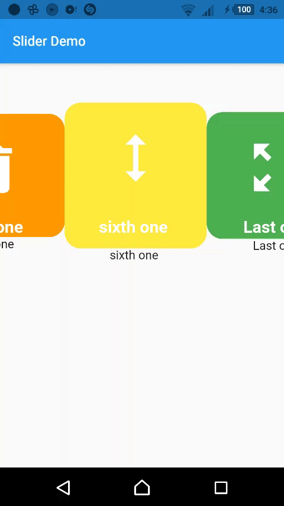

# Slider-Package

A new Flutter package contains a class called SnapSlider .
Slider Class used to creat a slider with some arguments like item height and width .

## Getting Started

creat a SnapSlider and pass to it your widgest list and also height , width and  view port fraction
 (its a ratio used to decied the size of main item ) of items .
 
##  Demos 
This project also contains :- 
Custom item slider demo .

Image album slider demo .

